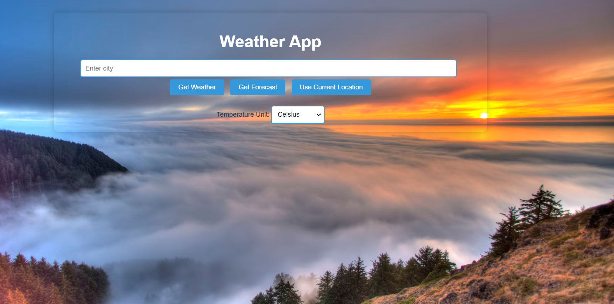

# Weather App
## Screenshots

## Description

This is a simple weather web application built using Flask. It provides current weather information and a 5-day weather forecast based on the city or your current location. The app is styled with custom CSS and uses the OpenWeatherMap API to fetch weather data. The frontend is designed with HTML templates and CSS for styling.
**Author:** [LinkedIn](https://www.linkedin.com/in/issam-slimani-52592a160).
## Project Structure

- `static/`: Contains CSS and image files.
  - `styles.css`: The main stylesheet for the application.
  - `images/last.png`: Background image for the app.
- `templates/`: Contains HTML template files.
  - `index.html`: The main HTML file rendered by Flask.
- `weather.py`: The main Python file for the Flask application.
- `vercel.json`: Configuration file for deploying the app on Vercel.
- `requirements.txt`: Lists the Python dependencies for the project.

## Setup

1. Clone the repository:
   `git clone <repository-url>`

2. Navigate to the project directory:
   `cd <project-directory>`

3. Install the required dependencies:
   `pip install -r requirements.txt`

4. Run the application:
   `python3 weather.py`

# Usage

After running the application, open your browser and go to [http://localhost:5000](http://localhost:5000). Enter a city name or allow the app to use your location to get the weather details.

## Deployment

The application is deployed on Vercel. The `vercel.json` file is configured to handle the deployment settings.
## Live Demo

You can view the live version of the app [here](https://weatherapp-pi-one.vercel.app/).

## Notes

- **Resizing for Fit:** If the application appears too large or does not fit your screen properly, you can adjust the zoom level of your browser.

# Contributing
Contributions are welcome! Feel free to fork the repository and submit a pull request. If you have suggestions for improvements or new features, please create an issue.

# Related Projects
- Another Weather App
- Weather Dashboard

# Licensing
This project is licensed under the MIT License. See the LICENSE file for details.

# Screenshots
*(Add your screenshots here)*

# My Story 🌟
I was inspired to create this Weather App during a rainy week when I wanted to check the weather easily. I wanted a project that could utilize my Flask skills and provide real-time data. The technical challenge was integrating the OpenWeatherMap API, as I had never worked with external APIs before. 

At first, I struggled with understanding API calls and handling JSON data. After several attempts and some late nights, I finally managed to fetch the data correctly! For future iterations, I envision adding features like user accounts, a more detailed historical weather analysis, and even a mobile version of the app. This project not only enhanced my coding skills but also reinforced my passion for creating user-friendly applications.
